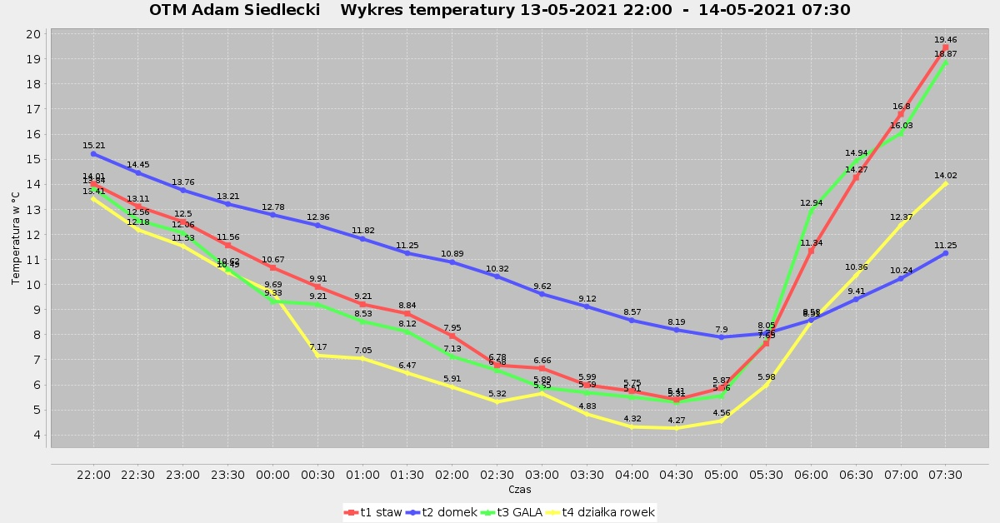

# OTM
Orchard Temperature Monitor is a tool for fruit growers that allows to check and monitor temperatures in distant places within orchard. During ground frosts, temperatures may vary a lot and it is important to have comprehensive information in order to implement adequate treatment (sich as spraying aspirin or other substances).

This application is just a part of a larger system, which also includes server on ESP8266 that communicate with Arduino stations in the orchard. It is responsible of fetching data from ESP server, storing it in database, processing and publishing it on a Facebook page when certain conditions are met.

<h3>Examples of charts:</h3>

  

  

<h3>Station overview:</h3>

  

<h3>Solar panels and station inside: </h3>

    

  

<h3>Facebook:</h3>

  

  

